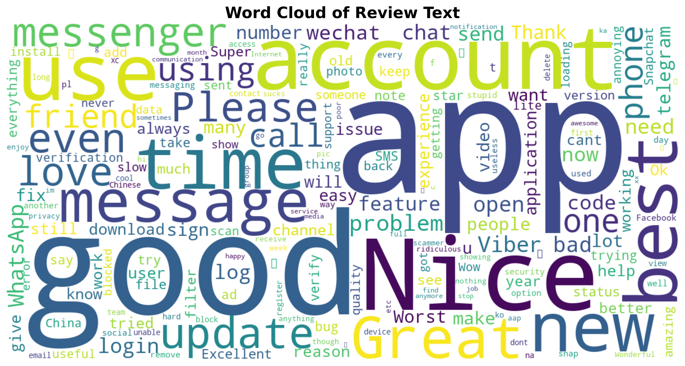
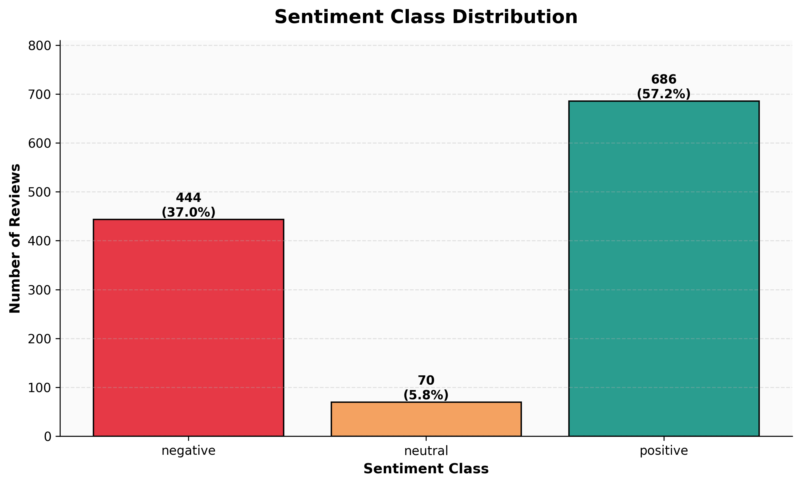

# 🧠 SAIA2163 NLP Final Project

A Streamlit-based Natural Language Processing (NLP) application developed as part of the **SAIA2163 Final Project**. The project focuses on **sentiment classification and text analysis** using both traditional machine learning techniques and transformer-based models.

---

## 👥 Team AKATSUKI

| No. | Name | Student ID |
|------|-------|------------|
| 1 | Muhammad Lukman Bin Nasrum | A24AI0061 |
| 2 | Hasnawi Imran Bin Mohd Saidi | A24AI0032 |
| 3 | Muhammad Zahin Bin Mohd Zamri | A24AI0065 |
| 4 | Raqib Hazim Bin Abdul Hamid | A24AI0118 |

---

## 📌 Project Overview

This project aims to classify text sentiments and provide insightful visualizations through an interactive Streamlit application. The workflow includes:

- Data preprocessing and cleaning
- Feature extraction using TF-IDF
- Model training and evaluation
- Sentiment prediction through a user-friendly interface
- Visualization of dataset characteristics and model performance

---

## 🤖 Models Implemented

| Model | Type |
|--------|-------|
| Logistic Regression | Machine Learning |
| Naive Bayes | Machine Learning |
| DistilBERT | Transformer-Based Deep Learning |

---

## 📊 Model Evaluation

The models were evaluated using an **80:20 train-test split** and compared using the following metrics:

- Accuracy
- Precision
- Recall
- F1-Score

The best-performing model was selected and saved using **Joblib** for deployment within the Streamlit application.

---

## 📈 Visualizations

### ☁️ Word Cloud


Visual representation of the most frequent words appearing in the dataset.

---

### 📊 Class Distribution


Shows the distribution of sentiment classes within the dataset.

---

### 🧩 Logistic Regression Confusion Matrix


Illustrates the classification performance of the Logistic Regression model.

---

### 🧩 Naive Bayes Confusion Matrix


Illustrates the classification performance of the Naive Bayes model.

---

### 🏆 Model Performance Comparison


Compares the evaluation metrics across different models.

---

### 🔤 Top 20 Most Frequent Words


Highlights the most commonly occurring words in the dataset.

---

## 📂 Project Structure

```text
SAIA2163-NLP-FINAL-PROJECT/
│
├── app.py
├── NLP_Final.ipynb
├── best_sentiment_pipeline.pkl
├── backend_metadata.pkl
├── Training_Data_Google_Play_reviews_6000.csv
├── preprocessed_reviews.csv
├── requirement.txt
├── README.md
│
└── images/
    ├── wordcloud.png
    ├── class_distribution.png
    ├── confusion_matrix_lr.png
    ├── confusion_matrix_nb.png
    ├── model_comparison.png
    └── top20_words.png
```

---

## ⚙️ Installation

### 1. Create a Virtual Environment

```bash
python -m venv .venv
```

### 2. Activate the Environment

**Windows**

```bash
.venv\Scripts\activate
```

**macOS / Linux**

```bash
source .venv/bin/activate
```

### 3. Install Dependencies

```bash
pip install -r requirement.txt
```

---

## 🚀 Running the Project

### Run the Notebook

Open the notebook:

```bash
jupyter notebook
```

Then execute:

```text
NLP_Final.ipynb
```

Select the training dataset when prompted.

---

### Run the Streamlit Application

```bash
streamlit run app.py
```

After running the command, open the local URL generated by Streamlit in your browser.

---

## 🛠️ Technologies Used

- Python
- Pandas
- NumPy
- NLTK
- Scikit-learn
- Hugging Face Transformers
- PyTorch
- Streamlit
- Matplotlib
- WordCloud
- Joblib

---

## 📚 Course Information

**Course:** SAIA2163 – Natural Language Processing

**Project:** Final Group Project

**Institution:** Universiti Teknologi Malaysia (UTM)

---

## 📄 License

This repository was developed for academic purposes as part of the SAIA2163 coursework.