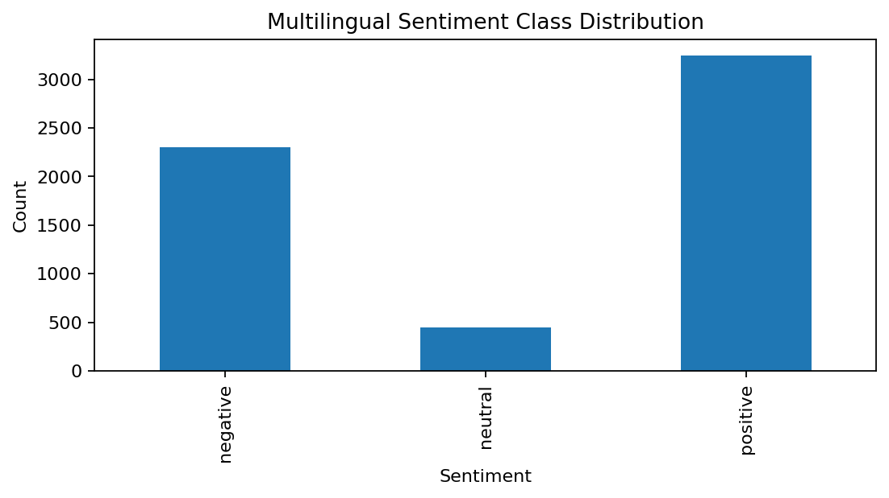
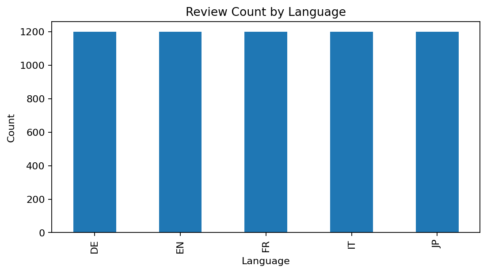
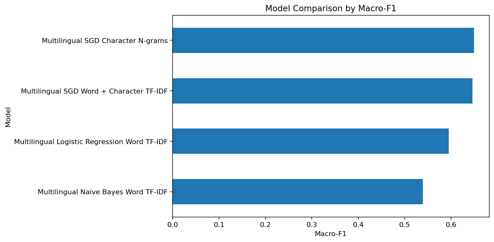
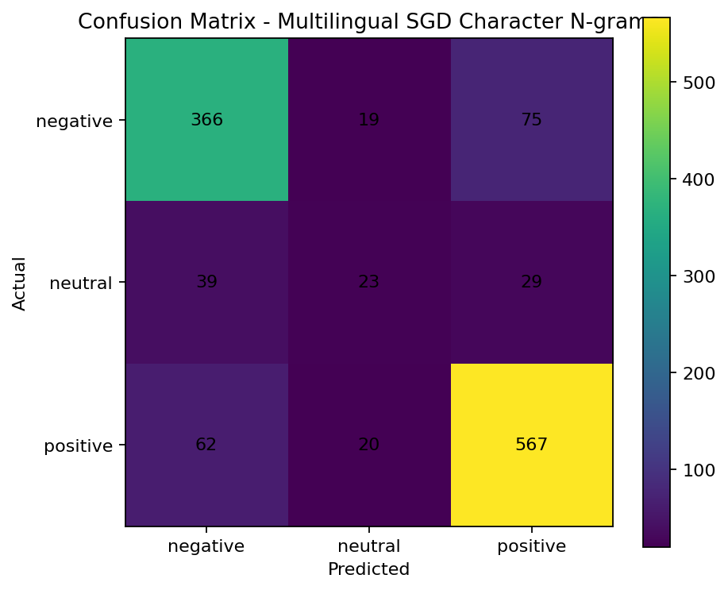

# SAIA2163 NLP Final Project — Multilingual App Review Sentiment Analysis

A multilingual sentiment analysis system for Google Play app reviews. The project classifies user reviews into **negative**, **neutral**, and **positive** sentiment using traditional machine learning, multilingual text preprocessing, model comparison, and an interactive Streamlit web application.

This version improves the original English-only pipeline by supporting multiple languages, using multilingual-safe preprocessing, adding character-level features for noisy app reviews, and evaluating models using both overall and class-balanced metrics.

---

## Project Highlights

* Supports multilingual reviews: **English, French, German, Italian, and Japanese**
* Classifies review sentiment into **negative**, **neutral**, and **positive**
* Uses multilingual-safe preprocessing instead of English-only lemmatization
* Adds language tags such as `lang_en`, `lang_fr`, `lang_de`, `lang_it`, and `lang_jp`
* Compares multiple machine learning approaches
* Includes word-level and character-level TF-IDF features
* Evaluates models using Accuracy, Precision, Recall, F1-score, Macro-F1, and Neutral Recall
* Includes optional multilingual Transformer fine-tuning using XLM-RoBERTa
* Provides a Streamlit web app for real-time sentiment prediction
* Saves visualizations and evaluation outputs for analysis and reporting

---

## Problem Statement

App stores contain thousands of user reviews written in different languages. These reviews often include short text, slang, emojis, misspellings, and mixed sentiment. Manually reading and interpreting them is time-consuming.

This project builds an NLP system that automatically predicts the sentiment of multilingual app reviews so that developers and researchers can better understand user feedback.

---

## Dataset

The dataset used in this project is:

```text
Training_Data_Google_Play_reviews_6000.csv
```

It contains Google Play reviews across five languages:

| Language Code | Language |
| ------------- | -------- |
| EN            | English  |
| FR            | French   |
| DE            | German   |
| IT            | Italian  |
| JP            | Japanese |

The review score is mapped into sentiment labels:

| Review Score | Sentiment Label |
| ------------ | --------------- |
| 1–2          | Negative        |
| 3            | Neutral         |
| 4–5          | Positive        |

---

## Why Multilingual Processing?

The earlier version filtered only English reviews. This made the dataset smaller and caused the neutral class to be very underrepresented. The multilingual version uses all available languages, increasing the amount of training data and improving the model's ability to learn from diverse review patterns.

However, multilingual data also means English-only preprocessing is no longer suitable. Therefore, this version removes English-only lemmatization and English-only stopword removal. Instead, it applies Unicode-safe cleaning and uses TF-IDF features that can work across different languages.

---

## Methodology

### 1. Data Loading

The raw CSV dataset is loaded using Pandas. Language codes are normalized by stripping spaces and converting them to uppercase.

### 2. Sentiment Label Mapping

Review scores are converted into sentiment classes:

```python
1 or 2 -> negative
3      -> neutral
4 or 5 -> positive
```

### 3. Multilingual Text Preprocessing

The preprocessing pipeline performs:

* Unicode-safe text cleaning
* URL removal
* HTML entity cleanup
* Extra whitespace normalization
* Language token injection
* Light text normalization without destroying non-English text

This project does **not** apply English-only lemmatization in the multilingual pipeline because lemmatization rules differ by language.

### 4. Feature Engineering

The project uses TF-IDF features with different strategies:

* Word-level TF-IDF
* Character-level n-grams
* Combined word + character TF-IDF

Character n-grams are useful for app reviews because user reviews often contain misspellings, short words, slang, and multilingual text patterns.

### 5. Model Training

Several models are trained and compared:

* Multilingual Naive Bayes Word TF-IDF
* Multilingual Logistic Regression Word TF-IDF
* Multilingual SGD Character N-grams
* Multilingual SGD Word + Character TF-IDF
* Optional XLM-RoBERTa multilingual Transformer

### 6. Model Selection

The final application model is selected based on balanced evaluation, especially **Macro-F1** and **Neutral Recall**, not accuracy alone.

Accuracy measures overall correctness, but Macro-F1 is more useful for this project because the sentiment classes are imbalanced. A model can achieve high accuracy while still failing to detect neutral reviews.

---

## Model Results

The multilingual traditional machine learning model achieved strong overall performance while also improving minority-class handling.

| Model                                    | Accuracy | F1-score | Macro-F1 | Neutral Recall |
| ---------------------------------------- | -------: | -------: | -------: | -------------: |
| Multilingual SGD Word + Character TF-IDF |  ~0.8133 |  ~0.8016 |  ~0.6554 |        ~0.2088 |
| Optional XLM-RoBERTa Transformer         |  ~0.8192 |        - |  ~0.5636 |         0.0000 |

Although the Transformer achieved slightly higher accuracy, it failed to detect neutral reviews. Therefore, the traditional multilingual TF-IDF model is preferred for the final Streamlit application because it provides better class-balanced performance.

---

## Per-Language Evaluation

The system also saves language-level evaluation results to:

```text
multilingual_language_metrics.csv
```

This allows analysis of model performance across English, French, German, Italian, and Japanese reviews.

---

## Visualizations

Generated visualizations are stored in the `images/` folder.

Important visual outputs include:

| File                                  | Description                              |
| ------------------------------------- | ---------------------------------------- |
| `class_distribution_multilingual.png` | Sentiment class distribution             |
| `language_distribution.png`           | Review count by language                 |
| `model_accuracy_comparison.png`       | Model comparison by accuracy             |
| `model_macro_f1_comparison.png`       | Model comparison by Macro-F1             |
| `confusion_matrix_best_model.png`     | Confusion matrix for the selected model  |
| `wordcloud_multilingual.png`          | Word cloud from multilingual review text |

Example images:









---

## Streamlit Web Application

The project includes a Streamlit app for interactive sentiment prediction.

Users can enter a review, choose or infer the language, and receive:

* Predicted sentiment
* Confidence score
* Model information
* Dataset and evaluation summary
* Visual analysis outputs

Run the app with:

```bash
streamlit run app.py
```

---

## Project Structure

```text
SAIA2163-NLP-Final-Project/
│
├── app.py
├── preprocessing_utils.py
├── train_multilingual_models.py
├── NLP_Final_Student4_Multilingual_Improved.ipynb
├── Training_Data_Google_Play_reviews_6000.csv
│
├── best_sentiment_pipeline.pkl
├── backend_metadata.pkl
├── backend_metadata.json
├── preprocessed_reviews.csv
├── final_model_predictions.csv
├── model_evaluation_comparison.csv
├── multilingual_language_metrics.csv
│
├── images/
│   ├── class_distribution_multilingual.png
│   ├── language_distribution.png
│   ├── model_accuracy_comparison.png
│   ├── model_macro_f1_comparison.png
│   ├── confusion_matrix_best_model.png
│   └── wordcloud_multilingual.png
│
├── requirement.txt
└── README.md
```

---

## Installation

### 1. Clone the repository

```bash
git clone https://github.com/Pokeepic/SAIA2163-NLP-Final-Project.git
cd SAIA2163-NLP-Final-Project
```

### 2. Create a virtual environment

Windows PowerShell:

```bash
python -m venv .venv
.venv\Scripts\Activate.ps1
```

Command Prompt:

```bash
python -m venv .venv
.venv\Scripts\activate
```

macOS/Linux:

```bash
python -m venv .venv
source .venv/bin/activate
```

### 3. Install dependencies

```bash
pip install -r requirement.txt
```

---

## Training the Models

To train the multilingual machine learning models:

```bash
python train_multilingual_models.py --data Training_Data_Google_Play_reviews_6000.csv
```

This generates:

```text
best_sentiment_pipeline.pkl
backend_metadata.pkl
backend_metadata.json
preprocessed_reviews.csv
final_model_predictions.csv
model_evaluation_comparison.csv
multilingual_language_metrics.csv
images/
```

---

## Running the App

After training is complete, run:

```bash
streamlit run app.py
```

The app will load:

```text
best_sentiment_pipeline.pkl
backend_metadata.pkl
backend_metadata.json
```

---

## Optional Transformer Experiment

The project includes optional multilingual Transformer training using XLM-RoBERTa.

The Transformer is useful for comparison, but it is not used as the final deployed app model because it achieved lower Macro-F1 and failed to detect neutral sentiment in the current experiment.

Transformer output may be saved in:

```text
multilingual_transformer_model/
transformer_results_multilingual/
```

These folders can be large and are not required to run the Streamlit app.

---

## Key Findings

* Multilingual training improved the dataset size compared to English-only filtering.
* Neutral sentiment remained the most difficult class because it is less frequent and sometimes textually ambiguous.
* Accuracy alone was not enough to select the best model.
* Macro-F1 and Neutral Recall gave a fairer view of model quality.
* Character-level n-grams were useful for multilingual and noisy review text.
* The Transformer achieved high accuracy but poor neutral detection, so it was not selected as the final app model.

---

## Limitations

* Neutral reviews are still difficult to classify accurately.
* Score-based sentiment labels can introduce noise because some 3-star reviews contain positive or negative wording.
* The model may struggle with very short reviews such as “Good”, “Nice”, or emoji-only reviews.
* The word cloud may not perfectly represent Japanese text due to font and tokenization limitations.
* The current version uses classical ML for deployment rather than a large Transformer model to keep the app lightweight.

---

## Future Improvements

Possible improvements include:

* Adding more neutral reviews to reduce class imbalance
* Using language-specific preprocessing for each language
* Improving Japanese tokenization with a dedicated tokenizer
* Adding emoji-to-text conversion
* Using multilingual sentence embeddings
* Applying oversampling or focal loss for neutral sentiment
* Deploying the Streamlit app online
* Adding confidence calibration for predictions

---

## Technologies Used

* Python
* Pandas
* NumPy
* Scikit-learn
* Streamlit
* Matplotlib
* Seaborn
* WordCloud
* Hugging Face Transformers
* XLM-RoBERTa

---

## How to Use the Notebook

Open:

```text
NLP_Final_Student4_Multilingual_Improved.ipynb
```

Run the notebook cells from top to bottom to reproduce preprocessing, training, evaluation, and visualization results.

---

## Authors

This project was developed for the SAIA2163 Natural Language Processing final project.

---

## License

This project is for academic and educational purposes.
